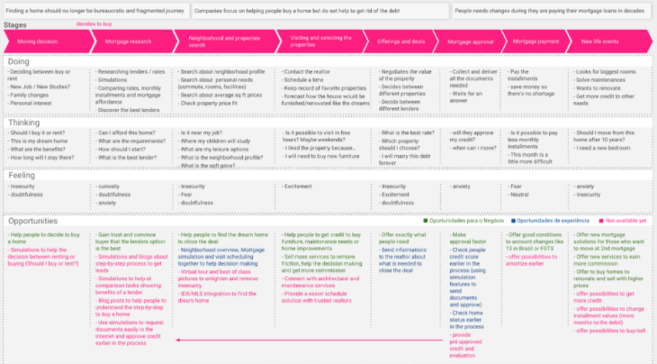
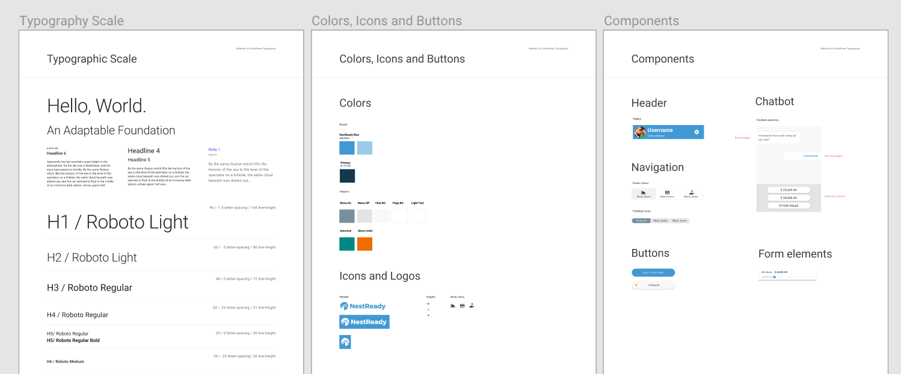
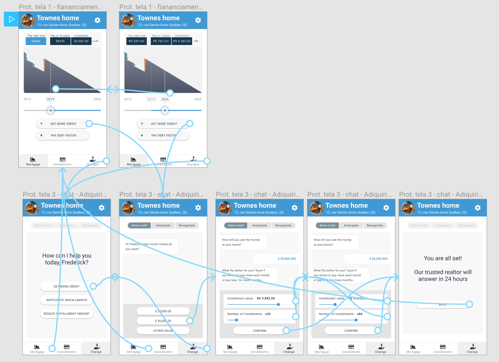

# Get the application running

## bluejay_api

This project serves an API to be used by bluejay client.

It runs with ruby 2.5.1 and postgresql 10. Having those 2 first dependencies installed, you
should get the server up by doing the following inside `vanckathon-nestready/bluejay_api` directory:

Install gems:
```
gem install bundler
bundle install
```

Setup the database:
```
bundle exec rails db:setup
bundle exec rails db:seed
```

Run the tests to see if everything is working:
```
bundle exec rails test
```

Start rails server:
```
bundle exec rails server
```

Server will be running on `http://localhost:3000`

# Blue Jay

The NestReady Debt Relationship solution

"Blue Jays is a Canadian bird known for their intelligence and their tight family bonds"
https://www.allaboutbirds.org/guide/Blue_Jay/lifehistory


We named our chatbot Blue Jay because it cares about your nest. It smartly helps you to seamless deal for decades with probably one of the biggest bonds of your life: the mortgage.

2min demo
https://www.youtube.com/watch?v=YA33RuNXs_s&feature=youtu.be


## Context


NestReady mission is to help people to have a seamless end-to-end home buying experience placing the mortgage lenders as the trusted brand for every home buying need.

It means:

For the user

- one single trusted brand to interact along all the journey,
- a faster process from the idea to find a new home until moving to the new property, and
- more information to make the best decision.

Business needs

- the increase of conversion rates,
- the increase of qualified leads, and
- portfolio retention.

We understand that the home buying experience starts when people are thinking to move. It happens even before deciding between rent or buying. The journey only ends after the debt is fully paid or even further if the client decides to move again. In other words, we have a huge path full of opportunities.

User Journey Map v1

https://docs.google.com/presentation/d/13Am5Ts5ehQ0vTABKf-RbOOE6AjYVzN6kzUHgVc-SonU/edit#slide=id.g545b121198_0_0



Getting more than 100 answers on an online survey we discovered facts about mortgage payers in Brazil:

- 63% frequently checks the mortgage status (how long, how much)
- 40% do not plan but dream to finish the debt earlier
- 86% needs to go to the bank manager to ask for help

## Hackathon Goal

After reviewing the main steps of the journey we selected one business opportunity for this hackathon:

Improve the user experience during the longest step of the home-buying journey: the mortgage payment. We want to free the client from the need to get to the bank again to check mortgage status, amortize or get more credit managing installment attributes like time remaining and monthly amount.

## Product

We created Blue Jay, a chatbot-like form to help the users to reach their new goals during decades. It does not matter if the client wants to pay the debt faster or get more money to buy new furniture, renovate the home, build a new bedroom for children or even move again.

Blue Jay is your trusted friend to let you keep full control of the number or amount of installments you still are bond to.

The Golden Path of the product should:

1. Let the user choose between getting more credit or pay the debt faster,
2. Let the user define the amount of credit needed
3. Let the user easily choose if he will increase the amount of the installment or increase the time left to pay
4. Warn the user that the approval is a manual step but we will contact him shortly
5. Send an e-mail to the Realtor with the user's information

Next steps are:

1. Let the user pay debt faster using unexpected money like profit sharing, or the Brazilian's FGTS (if there is something similar)
2. Let the user verify the debt attributes in the future (for example: what will be the installment amount or the full amortization amount in five years)

# Find more information

### 2min demo
https://www.youtube.com/watch?v=YA33RuNXs_s&feature=youtu.be

### Blue Jay Design System - Colors, Icons, Typos, Components, Buttons, Navigation.
https://www.figma.com/proto/Xn1u1IC5tqyOefbykHopuRpf/NestReady?node-id=67%3A1574&viewport=371%2C276%2C0.464019&scaling=min-zoom



### Prototype

Test scenario: Now that you got a new remote job, your task is to ask Blue Jay for more credit to renovate your home-office.
https://www.figma.com/proto/Xn1u1IC5tqyOefbykHopuRpf/NestReady?node-id=17%3A1&viewport=453%2C41%2C0.23747&scaling=min-zoom



### Live app

[add link] - coming soon
